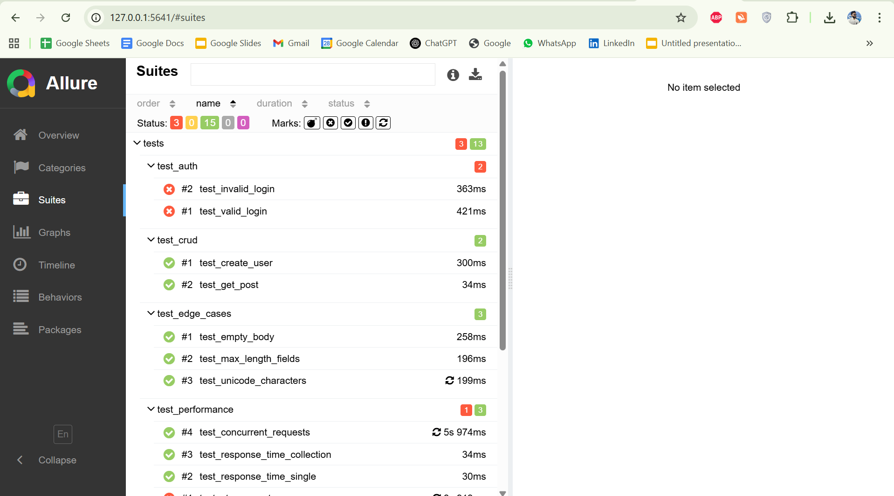
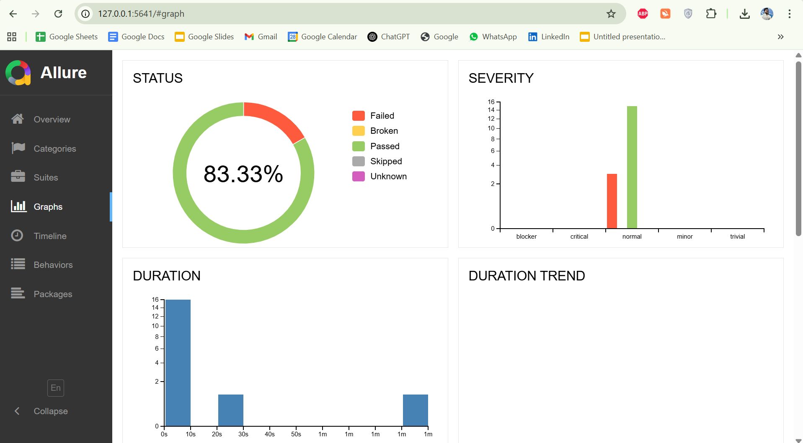

# API Automation Framework (PyTest + Allure)

## Install
```bash
pip install -r requirements.txt
```

---

## Run tests and generate Allure report
```bash
pytest -m smoke --alluredir=reports
pytest --alluredir=reports
allure serve reports
```

---

## How to get GoRest API Token
1. Visit: https://gorest.co.in/
2. Click on **Get Access Token**
3. Sign in (Google/GitHub)
4. Copy your token and paste it into `.env` as:
   ```
   GOREST_TOKEN=your_token_here
   ```

---

## Allure Report Screenshots

Below are screenshots from the generated Allure HTML Report showing various views captured after test execution.

### 1. Dashboard Overview
Displays the overall execution summary including passed, failed, and skipped test counts.  


### 2. Test Suites Summary
Shows the grouping of test cases, their hierarchy, and execution status for navigation.  


### 3. Detailed Test Results
Illustrates each test case with step details, assertions, and expected vs actual results.  


### 4. Execution Steps and Logs
Shows step-by-step execution flow with attached logs and validation details.  


### 5. Attachments and Artifacts
Displays screenshots, responses, and other artifacts captured during test execution.  


### 6. Graphs and Trends
Provides visual analytics for execution trends and performance statistics.  

